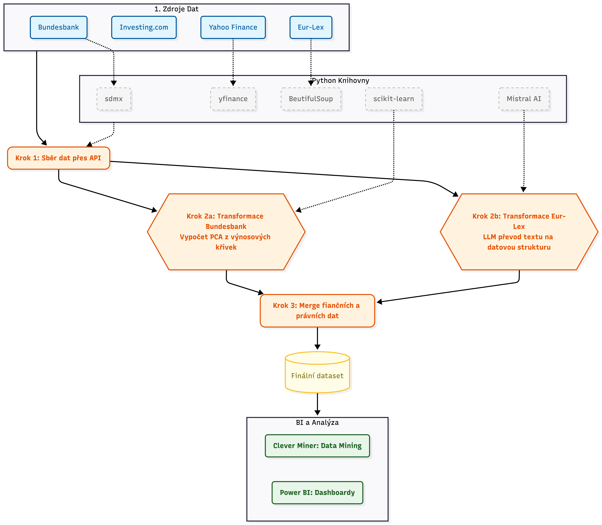

# Analýza vlivu evropské legislativy na německý finanční trh

Tento projekt byl vytvořen v rámci předmětu 4IZ503. Projekt zkoumá vazby mezi legislativními akty Evropské unie a dynamikou německé výnosové křivky. Cílem je ověřit hypotézu o zvýšené citlivosti institucionálních investorů na změny právního rámce nesoucí budoucí ekonomické náklady a strukturální rizika. 

---

## Postup zpracování (Pipeline)

1. **Načtení legislativy:** Načtení legislativních záznamů z https://eur-lex.europa.eu/ a následné scrapování kódů právních aktů.
2. **LLM Extrakce:** Odeslání textů legislativy do LLM (Mistral AI) pro vytěžení požadovaných proměnných a uložení do `result_full.csv`. 
3. **PCA Transformace:** Načtení historických křivek úrokových sazeb z databáze Bundesbank a jejich transformace pomocí PCA.
4. **Zpracování tržních dat:** Kategorizace makroekonomických parametrů a výpočet procentuálních změn tržních dat (DAX, VDAX, EUR/USD).
5. **Sloučení datových sad:** Sloučení legislativních výstupů s finančními daty na základě data vydání dokumentu a uložení do tabulky `final.csv`.
6. **Data Mining:** Tvorba asociačních pravidel nad kategorizovanými proměnnými pro nalezení vztahů mezi aktem EU a reakcí trhu. Asociační pravidla byla vybrána na základě poznatků a vizualizací z Power BI viz. `projekt_seminar.pbix` .

---

## Závěry

Analýza odhalila vliv komplexity předpisů a sektorovou asymetrii, kdy směrnice v průmyslu a energetice výnosovou křivku zplošťují, zatímco finanční regulace zvyšují její sklon. Rozhodnutí ve stavebnictví a financích navíc vyvolávají zvýšenou volatilitu trhu.
Kaopak legislativa v oblasti životního prostředí koreluje s stabilnějším tržním prostředím. 

Ovšem pro budoucí analýzy doporučuji upustit od asociačních pravidel, která byla povinná v rámci kurzu, a namísto toho zachovat dataset jako časovou řadu s numerickými proměnnými pro aplikaci modelů jako je SVAR.
